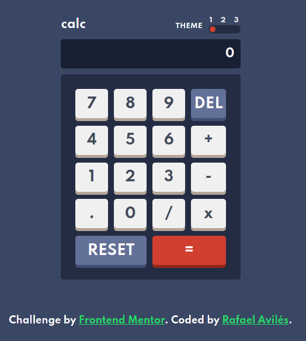

# Frontend Mentor - Calculator app solution

This is a solution to the [Calculator app challenge on Frontend Mentor](https://www.frontendmentor.io/challenges/calculator-app-9lteq5N29).

## Table of contents

- [Overview](#overview)
  - [The challenge](#the-challenge)
  - [Screenshot](#screenshot)
  - [Links](#links)
- [My process](#my-process)
  - [Built with](#built-with)
  - [What I learned](#what-i-learned)
  - [Continued development](#continued-development)
  - [Useful resources](#useful-resources)
- [Author](#author)


## Overview

### The challenge

Users should be able to:

- See the size of the elements adjust based on their device's screen size
- Perform mathmatical operations like addition, subtraction, multiplication, and division
- Adjust the color theme based on their preference
- **Bonus**: Have their initial theme preference checked using `prefers-color-scheme` and have any additional changes saved in the browser

### Screenshot



### Links

- [Solution](https://www.frontendmentor.io/solutions/math-is-difficult-2VvySWsMx)
- [Live Site](https://frontend-calculator.herokuapp.com/)

## My process

### Built with

- Semantic HTML5 markup
- CSS custom properties
- Flexbox
- CSS Grid
- Mobile-first workflow

### What I learned

Through this project I tried a variety of implementations for the basic functionality of a calculator. What ended up "working" -I say "working" because it is still a WIP- for me was to utilize classes. I come from a C# and Python background, so I felt right at home when it came to implementing classes in Javascript.

```js
class ButtonClickHandler {
    constructor() {
        this.value = 0;
        this.value2 = 0;
        this.afterEquals = false;
        this.termOperator = null;
        this.operatorPressed = null;
    }
...
}
```

### Continued development

I need to continue working on implementing the math functionality, but I got other projects to work on and can't spend too much time on it. I also feel like I need to familiarize myself better with "prefer-color-scheme", since I didn't really spend time implementing it in this case.

### Useful resources

- [a11y Styled Form Controls](https://github.com/scottaohara/a11y_styled_form_controls) - This repo helped me figure out what would be an accessible implementation of the theme toggle section, and I'll keep it in handy for future projects.
- [Andrew's Multi-Position Radio Switches](https://codepen.io/renddrew/pen/bRomab?editors=1100) - This is a great codepen which helped me understand and visualize the structure of the html needed to implement a theme toggle.

## Author

- Website - [Rafael Avilés](https://personal-website-seven-ashy.vercel.app/)
- Frontend Mentor - [@rafaVls](https://www.frontendmentor.io/profile/rafaVls)
- Twitter - [@RafaelAvls](https://www.twitter.com/RafaelAvls)
